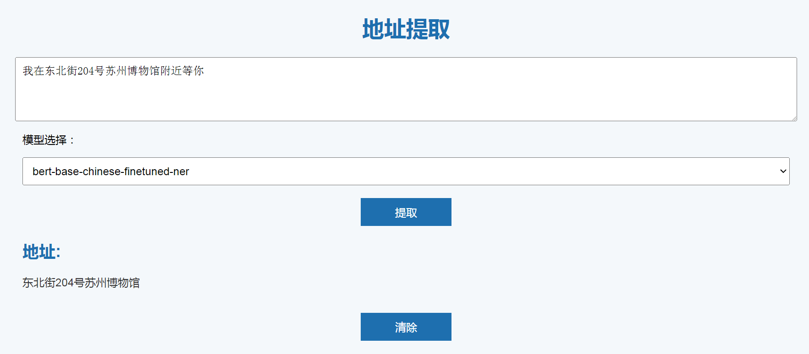
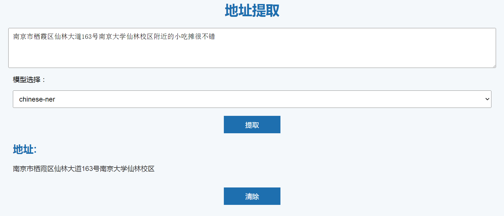

# NER_address_demo
Address extraction demo based on NER and flask

基于NER模型和flask框架的地址提取demo

从Hugging Face下载模型文件到model文件夹内，修改app.py文件内的对应模型路径即可。

例如：
```
git clone https://github.com/JohnnyQAQ/NER_address_demo.git
cd ./NER_address_demo/model
git clone https://huggingface.co/Danielwei0214/bert-base-chinese-finetuned-ner
git clone https://huggingface.co/TingChenChang/chinese-ner
```
根据不同模型可自定义不同的地址提取逻辑

安装依赖：

```
pip install flask transformers
```

运行服务：
```
python app.py
```

浏览器打开```http://127.0.0.1:5000/```

web界面可选择不同的NER模型:




